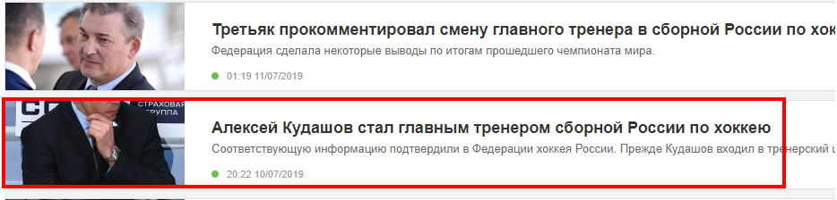

**********************************************
Релиз 0.22 (ST-981_) от 29.07.2019 (В работе)
**********************************************

Заметки по релизу. Список изменений:

.. _ST-981: https://mir24tv.atlassian.net/browse/ST-981

.. contents:: Содержание
   :depth: 2

Баг. MIRSCR-1105_
------------------------------
Админка. Сетка главной. Исправлена ошибка недоступности кнопки "Убрать".

Исправлена ошибка при которой в сетке главной, название публикации перекрывало кнопку "Убрать".

Баг. MIRSCR-1139_
------------------------------
Сайт. Страница публикации. Исправлена проблема с размером плашки "ЧИТАЙ НАС В ЯНДЕКС.НОВОСТЯХ" при изменении ширины страницы.

Исправлена проблема при которой, изменяя ширину страницы в сторону уменьшения, высота плашки "ЧИТАЙ НАС В ЯНДЕКС.НОВОСТЯХ" становилась больше "ПОЗНАЙ ДЗЕН С НАМИ".

Баг MIRSCR-1131_
------------------------------
Сайт. Лист с публикациями. Исправлена ошибка в координатах кропа.

Сайт. Исправлена ошибка отображения кропа публикации при просмотре списка всех публикаций по кнопке "Показать все". Пример такой ошибки является показ изображения с ошибочными координатами в `поиске новостей <https://mir24.tv/news/search?q=%D0%90%D0%BB%D0%B5%D0%BA%D1%81%D0%B5%D0%B9+%D0%9A%D1%83%D0%B4%D0%B0%D1%88%D0%BE%D0%B2&titleOnly=0>`_, элемент новости:

содержит кроп с координатами `.../200x106_0x635_list_crop_...jpg. <https://imgtest.mir24.tv/uploaded/images/crops/2019/July/200x106_0x635_list_crop_4cdc3004de1d27ce2ea51757a195acb736e872a4a406b1d441da7e652a37a879.jpg>`_ вместо `.../200x106_8x212_list_crop_...jpg. <https://imgtest.mir24.tv/uploaded/images/crops/2019/July/200x106_8x212_list_crop_4cdc3004de1d27ce2ea51757a195acb736e872a4a406b1d441da7e652a37a879.jpg>`_

Баг. MIRSCR-1134_
------------------------------
Админка. Служебные. Сюжеты. Исправлена ошибка в работе пагинации.

При поиске сюжетов в интерфейсе Сюжеты, в поисковой выдаче недоступны кнопки "НАЗАД" и "ВПЕРЕД", не позволяя отобразить все элементы "сюжетов" для выбора.

Баг. MIRSCR-1135_
------------------------------
Админка. Создание публикаций. Модальное окно "Добавить сюжеты". Исправлена проблема невозможности отображения всех результатов. Добавлена пагинация.

При поиске сюжетов в интерфейсе редактирования публикации, в модальном окне "Добавить сюжеты", в поисковой выдаче отображаются не все искомые элементы "сюжетов" для выбора. Добавлена навигация по элементам с помощью пагинации.

История. MIRSCR-1116_
------------------------------
Сайт. Мобильная версия. Лента новостей. Реализовано представление ленты новостей для мобильной версии.
Лента новостей реализованная в MIRSCR-1114_, описанная в Релизе 0.21 и в Обновления/Лента новостей, добавлена в мобильную версию сайта `mir24 <https://mir24.tv>`_.

История. MIRSCR-1143_
------------------------------
Сайт. Лента новостей. Убран элемент содержащий "0" из ленты новостей в свернутом состоянии.

Лента новостей реализованная в MIRSCR-1114_, описанная в Релизе 0.21 и в Обновления/Лента новостей, изменена в свернутом состоянии. Убран элемент содержащий "0".

Задача. MIRSCR-1126_
------------------------------
Деплой. Убрана жесткая зависимость между компонентами: ``backend-client``, ``photobank-client`` и ``backend-server`` позволяя разворачивать каждый компонент отдельно.

Изменена реализация, при которой: в процессе деплоя компоненты BC и PB после сборки копируются в компонент ``backend-server``, дальнейшее распределение запросов происходит за счет ``.htaccess`` файла. Приводящая к следующим проблемам:

* при отдельной сборке компонента ``backend-server`` - необходимо пересобирать и BC и PB (или же снова копировать их);
* при процедуре хотфикса BC или PB в папке компонента ``backend-server`` дублируются файлы, поскольку файлы новой сборки содержат новые хэши, и, соответственно, не перетирают старые.

Убрана жесткая зависимость между компонентами, распределение запросов происходит за счет настройки сервера, позволяя разворачивать каждый компонент отдельно.

Задача. OSA-91_
--------------------
Для релиза 0.22 настроено перенаправление запросов для панели управления мир24 (editors) следующим образом:

* запросы с ``/ftb/`` идут в ``photobank-client/current/dist`` на ``index.html`` (статика);
* запросы с ``/api/`` в ``backend-server/current/public`` на ``index.php`` (php);
* запросы с ``/uploaded/`` в ``backend-server/current/public`` (статика);
* все остальные запросы идут в ``backend-client/current/build`` на ``index.html`` (статика).

.. |sucss| image:: /images/youtube-sucss.jpg
.. |fail| image:: /images/youtube-fail.jpg

..	_MIRSCR-1114: https://mir24tv.atlassian.net/browse/MIRSCR-1114
..	_MIRSCR-1105: https://mir24tv.atlassian.net/browse/MIRSCR-1105
..	_MIRSCR-1139: https://mir24tv.atlassian.net/browse/MIRSCR-1139
..	_MIRSCR-1131: https://mir24tv.atlassian.net/browse/MIRSCR-1131
..	_MIRSCR-1134: https://mir24tv.atlassian.net/browse/MIRSCR-1134
..	_MIRSCR-1135: https://mir24tv.atlassian.net/browse/MIRSCR-1135
..	_MIRSCR-1116: https://mir24tv.atlassian.net/browse/MIRSCR-1116
..	_MIRSCR-1143: https://mir24tv.atlassian.net/browse/MIRSCR-1143
..  _MIRSCR-1126: https://mir24tv.atlassian.net/browse/MIRSCR-1126
..  _OSA-91: https://mir24tv.atlassian.net/browse/OSA-91
